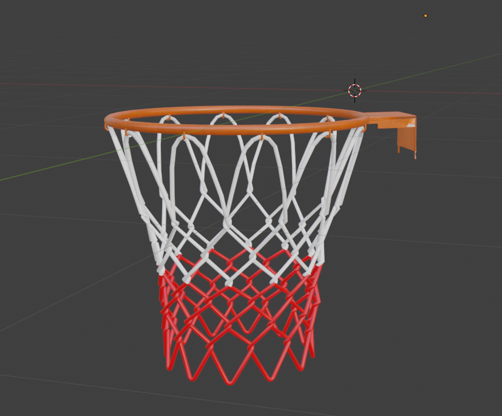

# OpenCv 识别篮筐

https://private-user-images.githubusercontent.com/121331111/557937374-1e3ab73a-c4c1-4323-98bd-d19cbb5c2195.mp4

## 尝试使用了Foundationpose获取篮筐位姿 但是算力要求过高 帧率过低，而且并不适合篮筐这类空心物体，最终放弃

https://private-user-images.githubusercontent.com/121331111/557948084-c35f8e25-2514-450a-ab36-e7d12fde240f.mp4